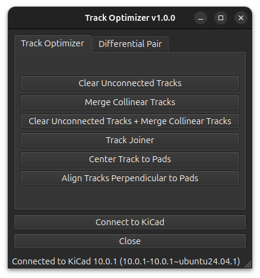
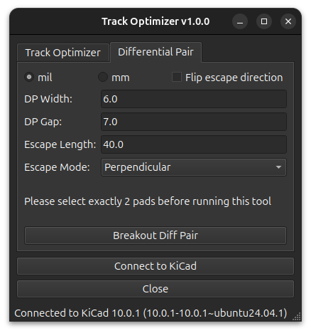
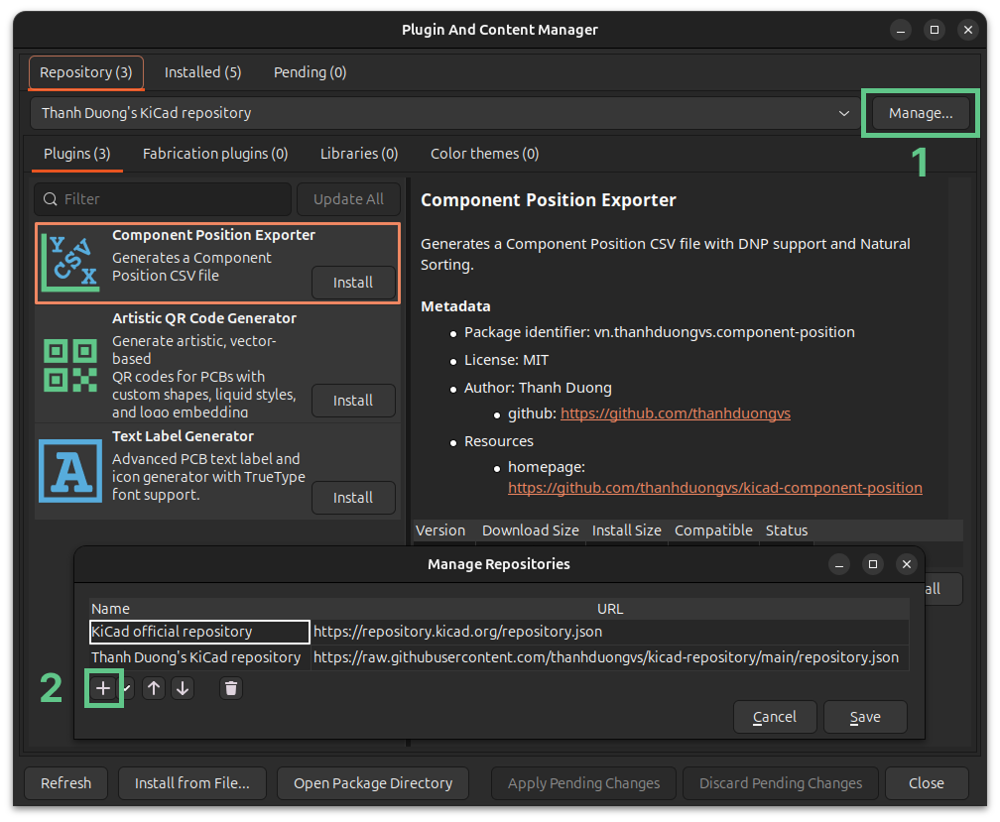

#  KiCad Track Optimizer

  

A powerful Python-based plugin designed to automatically clean up, optimize traces, and route high-speed differential pairs in **KiCad PCB designs**.

When modifying dense layouts, it is easy to leave behind microscopic unconnected stubs or accidentally draw overlapping tracks. This tool acts as an advanced geometric sweeper to clean your board instantly. Furthermore, it includes a smart breakout generator for differential pairs to ensure perfectly symmetrical and deskewed routing from IC pads.

<table>
  <tr>
    <td width="33%" align="center" valign="top">
      
    </td>
    <td width="33%" align="center" valign="top">
      
    </td>
  </tr>
</table>

## 🚀 Key Features

### 🧹 Track Optimization
* **Recursive Stub Removal:** Safely hunts down and deletes dangling track ends, even if they are made of multiple chained segments, without touching valid pads or vias.
* **Collinear & Overlap Merging:** Uses advanced vector projection to find tracks that are parallel and overlapping, merging them into a single continuous trace.
* **Smart Net Awareness:** Fully respects KiCad's electrical rules. It will never merge tracks of different nets or different widths, preventing accidental short circuits.

### ⚡ Differential Pair Breakout
* **Auto-Deskewed Breakout:** Automatically calculates and routes perfectly symmetrical escape tracks from two selected pads, compensating for any initial pad misalignment.
* **Collinear to Perpendicular Extrusion:** Generates mathematically perfect $90^\circ$ breakouts with customizable track widths, gaps, and escape lengths.
* **Flip Direction:** Easily reverse the escape routing direction with a single click to adapt to your surrounding layout.

* **Safe & Reversible:** All operations (both cleaning and routing) are wrapped in native KiCad commits, allowing you to easily `Ctrl+Z` (Undo) the entire process if needed.

## 🖥️ Usage

1. Open **PCB Editor**.
2. Go to **Tools** -> **External Plugins** -> **Track Optimizer** (or click the icon on the top toolbar).
3. **For Track Cleanup:**
   - Go to the **Track Optimizer** tab.
   - Choose to remove stubs, merge collinear tracks, or do both.
   - Click **Run**.
4. **For Differential Pairs:**
   - Select exactly **2 pads** on your PCB.
   - Go to the **Differential Pair** tab.
   - Set your desired Width, Gap, and Escape Length (supports both mm and mil).
   - Check "Flip direction" if you want the tracks to escape to the opposite side.
   - Click **Breakout Diff Pair**.

## 🛠️ Installation

### Via KiCad Plugin and Content Manager (Recommended)
Add our custom repo to **the Plugin and Content Manager**, the URL is:
`https://raw.githubusercontent.com/thanhduongvs/kicad-repository/main/repository.json`

### Manual Installation
- Download the plugin source code as **a .zip** file.
- Locate your KiCad plugins folder:
  - **Windows:** `Documents\KiCad\9.0\plugins`
  - **Linux:** `~/.local/share/kicad/9.0/plugins`
  - **macOS:** `~/Documents/KiCad/9.0/plugins`
- Extract the archive to the KiCad plugins directory.
- Restart KiCad / PCB Editor.

## 📦 Libraries Used
This project relies on several powerful open-source libraries:
 - [kicad-python](https://pypi.org/project/kicad-python/): KiCad API Python Bindings.
 - [PySide6](https://pypi.org/project/PySide6/): The official Python module from the Qt for Python project, used for the graphical user interface.

## 📜 License and Credits
Plugin code licensed under MIT, see `LICENSE` for more info.