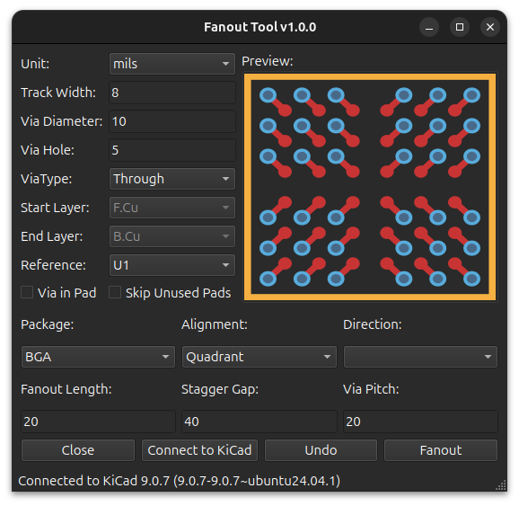

#  KiCad Track Optimizer

  

A powerful Python-based plugin designed to automatically clean up and optimize traces in **KiCad PCB designs**.
When modifying dense layouts, it is easy to leave behind microscopic unconnected stubs or accidentally draw overlapping tracks. This tool acts as an advanced geometric sweeper to clean your board instantly, preventing DRC errors and keeping your layout pristine.

## 🚀 Key Features
* **Recursive Stub Removal:** Safely hunts down and deletes dangling track ends, even if they are made of multiple chained segments, without touching valid pads or vias.
* **Collinear & Overlap Merging:** Uses advanced vector projection to find tracks that are parallel and overlapping, merging them into a single continuous trace.
* **Smart Net Awareness:** Fully respects KiCad's electrical rules. It will never merge tracks of different nets or different widths, preventing accidental short circuits.
* **Safe & Reversible:** Wraps all operations in a native KiCad commit, allowing you to easily `Ctrl+Z` (Undo) the entire cleanup process if needed.

## 🛠️ Installation

### Via KiCad Plugin and Content Manager (Recommended)
Add our custom repo to **the Plugin and Content Manager**, the URL is:
`https://raw.githubusercontent.com/thanhduongvs/kicad-repository/main/repository.json`

### Manual Installation
- Download the plugin source code as **a .zip** file.
- Locate your KiCad plugins folder:
  - **Windows:** `Documents\KiCad\9.0\plugins`
  - **Linux:** `~/.local/share/kicad/9.0/plugins`
  - **macOS:** `~/Documents/KiCad/9.0/plugins`
- Extract the archive to the KiCad plugins directory.
- Restart KiCad / PCB Editor.

## 📦 Libraries Used
This project relies on several powerful open-source libraries:
 - [kicad-python](https://pypi.org/project/kicad-python/): KiCad API Python Bindings.
 - [PySide6](https://pypi.org/project/PySide6/): The official Python module from the Qt for Python project, used for the graphical user interface.

## 📜 License and Credits

Plugin code licensed under MIT, see `LICENSE` for more info.